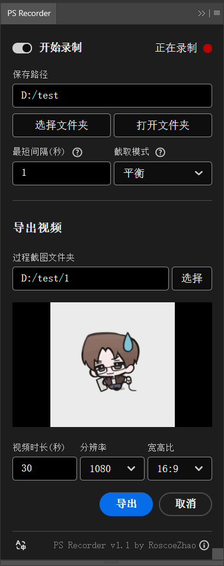

# PS Recorder 🎨📹

自动录制Photoshop绘画过程，每个画布分别保存到指定文件夹，可以导出指定时长和尺寸绘画过程缩时摄影视频。

🔽 [**下载最新版本**](https://pan.quark.cn/s/700a0c70fd64) | 
🌐 [**English**](README_EN.md)

## 安装说明
- 在此处下载最新版本
  - [🔽 夸克网盘](https://pan.quark.cn/s/700a0c70fd64)
  - [🔽 GitHub Release](https://github.com/RoscoeZhao/PS-Recorder/releases)

- 解压缩后，运行文件夹中的 **[install.bat]** 自动安装ps-recorder插件。
  - 如果自动安装失败，请尝试右键点击，以管理员身份运行。
  - 如果仍然安装失败，请尝试手动将 **[com.roscoe.ps-recorder]** 文件夹复制到：
  - **C:/Program Files (x86)/Common Files/Adobe/CEP/extensions/**
  
- 请手动将 **[com.roscoe.ps-recorder-generator]** 文件夹复制到：
  - **[Photoshop安装文件夹]/Plug-ins/Generator/**

## 使用说明 
- 这是一个**免费、开源**项目。联系或赞助开发者可以[点击此处](#contact)
- 在Photoshop中，点击 **工具栏-[窗口]-[扩展]或[扩展(旧版)]-[PS Recorder]** 打开插件面板
- 初次使用时，请先配置过程截图保存路径
- 每个画布录制的过程会分别保存到：**[选择的路径]/[画布名称]** 文件夹中
- 导出视频时可以手动选择对应的过程截图文件夹
- 只会在画布变化时自动录制。可以一直开启录制，不必担心空闲时占用内存或磁盘空间
- 如果画布很大或作画时间很长，适当增加间隔时间，可以提升性能、降低空间占用
- 截取模式：
  - 平衡：原图尺寸，中等画质。适合大多数情况
  - 压缩：节约空间，截图间隔长。适合磁盘空间有限的情况
  - 高画质：画质高，占用空间大。适合画布小或追求录制高画质的情况

## 兼容性
- 适用于Adobe Photoshop CC 2019 及以上版本
- 适用于Windows系统（MacOS的版本正在开发中。正在寻求MacOS PS用户帮忙测试：[联系开发者](#contact)）
- 如果遇到任何bug或兼容性问题可以[在此处反馈](https://github.com/RoscoeZhao/PS-Recorder/issues)或[联系开发者](#contact)

## 开发计划
- 适用于MacOS的版本（正在开发中。正在寻求MacOS PS用户帮忙测试：[联系开发者](#contact)）
- 前端配色自动适配Photoshop的主题配色
- 更多语言本地化（有意协助翻译欢迎[联系开发者](#contact)）
- 一键安装程序、卸载程序(?)
- 欢迎更多开发者参与开发：[欢迎PR](https://github.com/RoscoeZhao/PS-Recorder/pulls)

## 已知的问题
- 在画布较大时，短时间内连续的操作会导致截存时间变长，并只能截存到最新的画面（截取不到连续操作过程中的画面）
  - 在画布较大或性能有限时，此问题较为显著
  - 已知的原因：在`_generator.getDocumentPixmap()`正在运行时，如果图层变化会导致其重新采样，导致一次`getDocumentPixmap()`会持续更长时间，并返回最新的并未被图层变化中断的pixmap
  - 外部的阻塞并不能解决这个问题(?)

## 联系/赞助

扫码支持开源项目😊

- 开发者：赛博神灯 (Roscoe) <roscoe.zhao@qq.com>
- 承接各类游戏/各类软件项目的开发。也欢迎朋友们找我玩😊
- 如果喜欢这个项目的话，点击页面右上角的星星[Star⭐]支持这一项目！
- [请我喝杯咖啡?☕](https://buymeacoffee.com/roscoezhao)
- 鸣谢❤️：厭氧TS, xiaoqiang, F-know, Bolt-CEP, DeepSeek, 以及开源开发者们！
