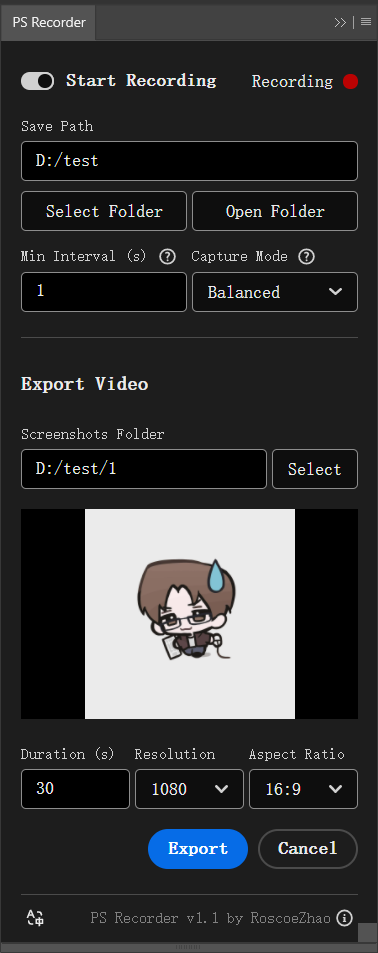

# PS Recorder 🎨📹

Automatically record Photoshop painting processes. Each canvas is saved to a seperate folder, allowing export of time-lapse videos with custom duration and resolution.

🔽 [**Download Latest Release**](https://github.com/RoscoeZhao/PS-Recorder/releases) | 
🌐 [**中文**](README.md)

## Installation
- Download the latest version here
  - [GitHub Release](https://github.com/RoscoeZhao/PS-Recorder/releases)
  - [Quark cloud drive](https://pan.quark.cn/s/700a0c70fd64)

- After unzipping, run **[install.bat]** in the folder to automatically install the ps-recorder plugin.
  - If auto-installation fails, try right-clicking and running as Administrator.
  - If installation still fails, manually copy the **[com.roscoe.ps-recorder]** folder to:
  - **C:/Program Files (x86)/Common Files/Adobe/CEP/extensions/**

- Then manually copy the **[com.roscoe.ps-recorder-generator]** folder to:
  - **[Photoshop Installation Folder]/Plug-ins/Generator/**

## Usage
- This is a **free and open-source** project. To contact or sponsor the developer, [click here](#contact)
- In Photoshop, go to **Toolbar-[Window]-[Extensions] or [Extensions (Legacy)]-PS Recorder** to open the plugin panel.
- Configure the screenshot save path before first use.
- Recording processes for each canvas will be saved to: **[Selected Path]/[Canvas Name]** folder.
- Manually select the corresponding screenshot folder when exporting videos.
- Recording only triggers on canvas changes. Keep it running without worrying about idle resource usage.
- For large canvases or long painting sessions, increase interval time to improve performance and reduce storage usage.
- Capture Modes:
  - Balanced: Original resolution, medium quality. Recommended for most scenarios
  - Compressed: Space-efficient with longer intervals. Ideal for limited storage
  - High Quality: High fidelity with larger storage usage. Best for small canvases or premium recording

## Compatibility
- Supports Adobe Photoshop CC 2019 and newer
- Windows compatible (macOS version in development)
- Report bugs or compatibility issues [here](https://github.com/RoscoeZhao/PS-Recorder/issues) or [contact developer](#contact)

## Dev Plan
- macOS compatibility (in development)
- Auto theme color adaptation to Photoshop UI
- More language localizations (translation contributions welcome: [Contact Developer](#contact))
- One-click installer/uninstaller(?)
- Developer contributions welcome: [Submit PRs](https://github.com/RoscoeZhao/PS-Recorder/pulls)

## Known Issues
- Large canvases may experience longer capture times during rapid operations, potentially missing intermediate states
  - More noticeable with large canvases or limited hardware
  - Root cause: Layer changes during `_generator.getDocumentPixmap()` execution may cause extended sampling time and return only the latest pixmap
  - External blocking may not resolve this issue(?)

## Contact/Sponsor
- Developer: Roscoe <roscoe.zhao@qq.com>
- Open for game dev/software project collab/remote works. Let's create something awesome! 😊
- [Buy Me a Coffee? ☕](https://buymeacoffee.com/roscoezhao)
- Special Thanks ❤️: 厭氧TS, xiaoqiang, F-know, Bolt-CEP, DeepSeek, and all open-source contributors!
